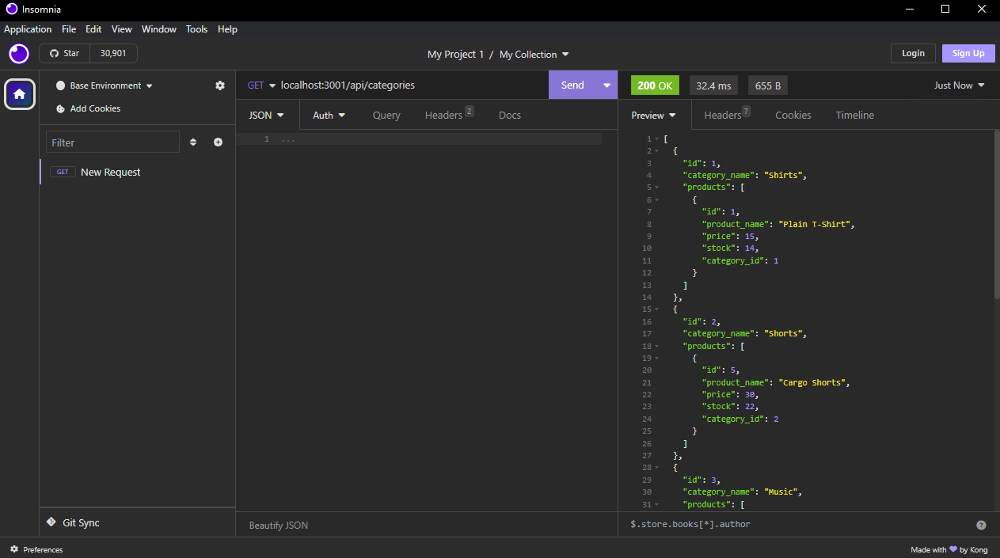

# E-Commerce-Backend
An E-Commerce backend that utilizes an Express.js API configured to use Sequelize to interact with a MySQL database.

# Description
This command line interface (CLI) application serves to store, create and delete inventory for an e-commerce store

# Installation
The user will need to have the latest version of node.js and Insomnia downloaded to their computer, as well as run "npm i" from the command line in order to use this code. Subsequesntly, the user will have to navigate to the command line to run the "SOURCE schema.sql" to create the database, then "node seeds/index.js" to embed seed data, and "node server.js" to run application. The user should then be able to run GET, PUT and POST requests through Insomnia.

# Demo Clip

https://drive.google.com/file/d/1HPNEl64IKeUJn6-RN_idPhNF0j0fTANd/view

# Credits
Aspects of code were used from this source - https://stackoverflow.com/questions/74891662/post-request-api-with-sql-server
Aspects of code were used from this source - https://stackoverflow.com/questions/40477625/nodejs-mysql-er-access-denied-error-access-denied-for-user-rootlocalhost
Aspets of code were used from this source - https://stackoverflow.com/questions/40764916/sequelize-is-not-defined-sequelize-and-consign

# License

MIT License

Copyright (c) 2023 amattock Permission is hereby granted, free of charge, to any person obtaining a copy of this software and associated documentation files (the "Software"), to deal in the Software without restriction, including without limitation the rights to use, copy, modify, merge, publish, distribute, sublicense, and/or sell copies of the Software, and to permit persons to whom the Software is furnished to do so, subject to the following conditions:

The above copyright notice and this permission notice shall be included in all copies or substantial portions of the Software.

THE SOFTWARE IS PROVIDED "AS IS", WITHOUT WARRANTY OF ANY KIND, EXPRESS OR IMPLIED, INCLUDING BUT NOT LIMITED TO THE WARRANTIES OF MERCHANTABILITY, FITNESS FOR A PARTICULAR PURPOSE AND NONINFRINGEMENT. IN NO EVENT SHALL THE AUTHORS OR COPYRIGHT HOLDERS BE LIABLE FOR ANY CLAIM, DAMAGES OR OTHER LIABILITY, WHETHER IN AN ACTION OF CONTRACT, TORT OR OTHERWISE, ARISING FROM, OUT OF OR IN CONNECTION WITH THE SOFTWARE OR THE USE OR OTHER DEALINGS IN THE SOFTWARE.